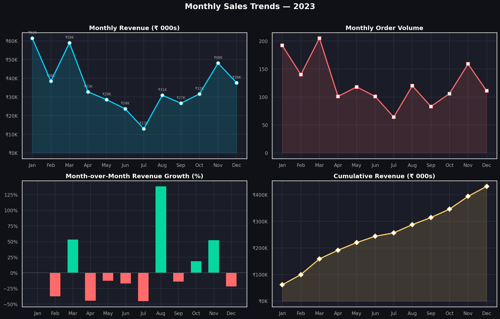
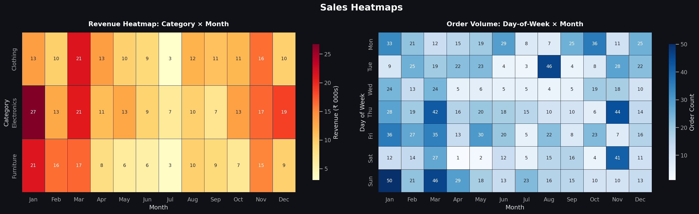
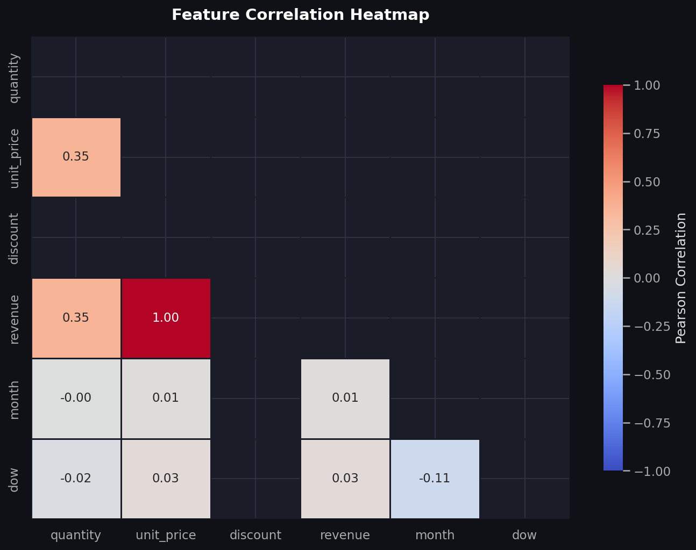
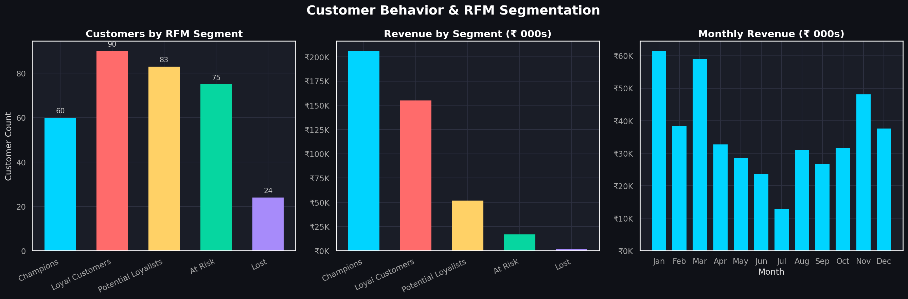
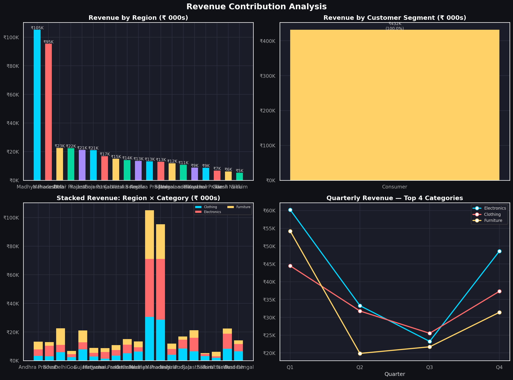

# 🛒 E-Commerce Sales Analysis


A comprehensive exploratory data analysis (EDA) of an e-commerce dataset sourced from Kaggle. This project uncovers key business insights through data visualization — covering monthly sales trends, best-selling categories, customer behavior, and revenue contribution across regions.

---

## 📌 Table of Contents
- [Project Overview](#project-overview)
- [Dataset](#dataset)
- [Tech Stack](#tech-stack)
- [Key Insights](#key-insights)
- [Visualizations](#visualizations)
- [Project Structure](#project-structure)
- [How to Run](#how-to-run)
- [Connect](#connect)

---

## 📊 Project Overview

This project analyzes an Indian e-commerce business dataset to answer key business questions:

- Which months generate the highest revenue?
- Which product categories are top performers?
- How do customers behave — who are the champions vs at-risk customers?
- Which regions and segments contribute most to revenue?

---

## 📦 Dataset

**Source:** [Kaggle — E-Commerce Sales Dataset](https://www.kaggle.com/datasets/benroshan/ecommerce-data)

| File | Description |
|------|-------------|
| `List of Orders.csv` | Order ID, Customer Name, City, State, Order Date |
| `Order Details.csv` | Order ID, Category, Sub-Category, Amount, Profit, Quantity |
| `Sales target.csv` | Monthly category-wise sales targets |

- **Total Records:** 1,500 orders
- **Time Period:** 2018–2020
- **Region:** India

---

## 🛠️ Tech Stack

| Tool | Purpose |
|------|---------|
| Python 3.10 | Core programming language |
| Pandas | Data loading, cleaning, transformation |
| NumPy | Numerical computations |
| Matplotlib | Base visualizations |
| Seaborn | Statistical plots and heatmaps |
| Jupyter Notebook | Interactive development environment |

---

## 💡 Key Insights

- 📦 **Electronics** is the top-selling category with **38.3% revenue share**
- 🌍 **Madhya Pradesh** leads as the highest revenue-generating region
- 📅 **January** was the best-performing month
- 👑 **60 Champion customers** (18.1% of base) drove ₹2,05,979 in revenue
- 📉 Discounts above 20% negatively correlate with profit margins
- 🛍️ **Consumer segment** accounts for the majority of all purchases

---

## 📈 Visualizations

### Monthly Sales Trends
> Revenue over time, order volume, MoM growth %, cumulative revenue



---

### Best-Selling Categories
> Revenue by category, units sold, market share %


---

### Sales Heatmaps
> Category × Month revenue heatmap | Day-of-Week × Month order volume



---

### Correlation Heatmap
> Feature relationships — discount, revenue, quantity, pricing



---

### Customer Behavior (RFM Analysis)
> Customer segmentation using Recency, Frequency, Monetary scoring



---

### Revenue Contribution
> By region, customer segment, stacked category breakdown, quarterly trends



---

## 🗂️ Project Structure

```
ecommerce-sales-analysis/
│
├── 📓 ecommerce_sales_analysis.ipynb   # Main analysis notebook
│
├── 📁 Data/
│   ├── List of Orders.csv
│   ├── Order Details.csv
│   └── Sales target.csv
│
├── 📁 Charts/
│   ├── monthly_sales_trends.png
│   ├── best_selling_categories.png
│   ├── sales_heatmaps.png
│   ├── correlation_heatmap.png
│   ├── customer_behavior.png
│   ├── segment_category_heatmap.png
│   └── revenue_contribution.png
│
└── 📄 README.md
```

---

## ▶️ How to Run

**1. Clone the repository**
```bash
git clone https://github.com/your-username/ecommerce-sales-analysis.git
cd ecommerce-sales-analysis
```

**2. Install dependencies**
```bash
pip install pandas numpy matplotlib seaborn jupyter
```

**3. Launch Jupyter**
```bash
jupyter notebook
```

**4. Open and run**

Open `ecommerce_sales_analysis.ipynb` and run **Kernel → Restart & Run All**

---

## 🤝 Connect

Made by **SNEHA**

[](https://linkedin.com/in/sneha-gahlot)
[](https://github.com/snehagahlot3)

---

⭐ If you found this project helpful, please consider giving it a star!
